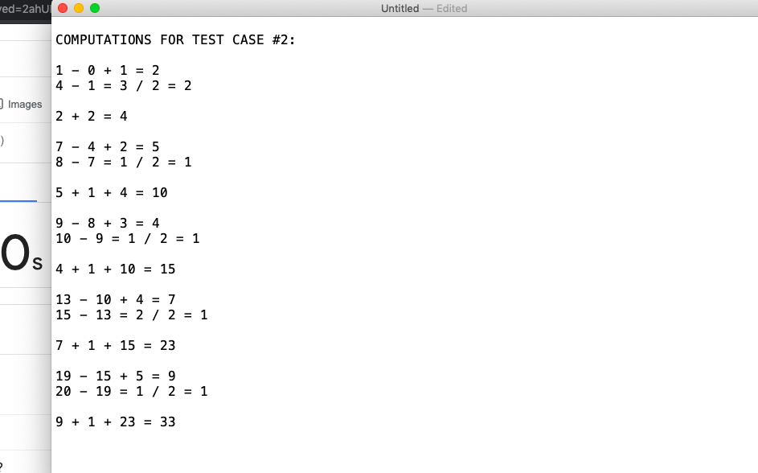

# Codeforces-1501A-Alexey-and-Train
Link: https://codeforces.com/problemset/problem/1501/A
## Computation for Test Case #2

<pre>
  The final answer should be '32' since we shouldn't count the staying time in the
  last station (n-th station).
</pre>
